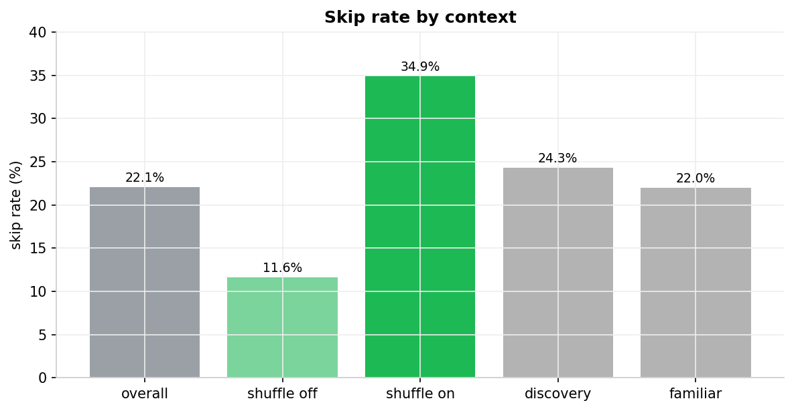
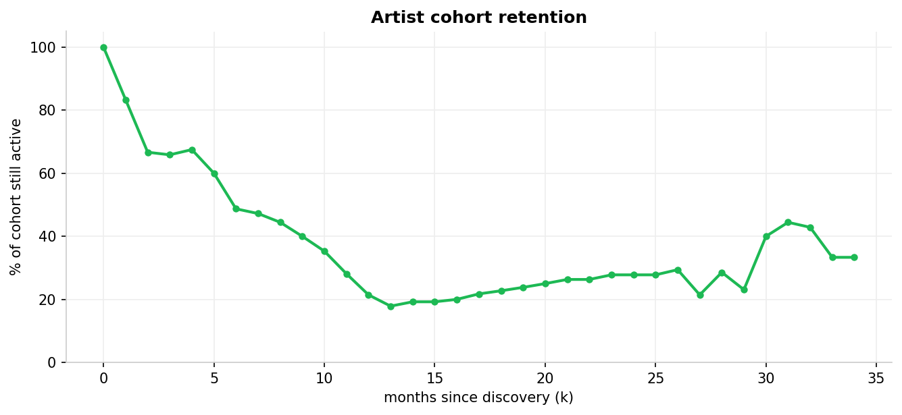
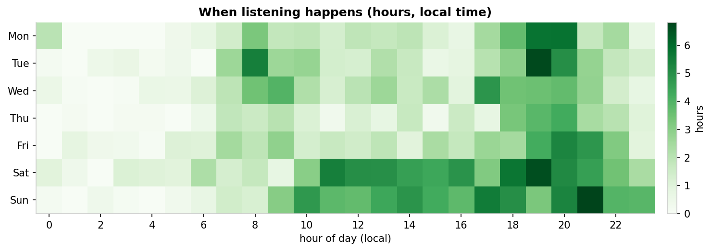

# Spotify Listening Analysis — *Wrapped, but honest*

A rigorous, **SQL-first** analysis of personal Spotify listening behavior that
goes past "Spotify Wrapped" to answer the questions Wrapped won't: *how does my
taste concentrate, how do I discover and abandon artists, and how does my
listening shift by time and context?*

The hook is **"Wrapped, but honest."** The substance is **product-analyst
technique** — sessionization, cohort retention, and a hypothesis test — applied
to a personal dataset. The defensible core is the SQL and the metric
definitions, not a model. See [`SPEC.md`](SPEC.md) for the full build spec and
[`REPORT.md`](REPORT.md) for the auto-generated findings readout.

> **The numbers in this README come from a fully synthetic sample**
> ([`data/sample/`](data/sample), generated by
> [`src/generate_sample.py`](src/generate_sample.py)) so the repo runs end-to-end
> with zero personal data. Swapping in the real Extended Streaming History export
> is a one-flag change — see [Running it](#running-it).

---

## Headline findings (synthetic sample)

| Question | Finding |
|---|---|
| What's my **real** skip rate? | **22.1%** overall — **34.9%** on shuffle vs **11.6%** on intentional plays |
| How concentrated is my taste? | Top **10%** of artists = **68.9%** of listening (HHI **0.119**) |
| Do I keep the artists I find? | **83%** of a cohort survive 1 month, **49%** at 6 months |
| Am I still exploring? | ~**1.7** new artists/month |
| When do I listen? | Peaks **Sunday evenings ~21:00** (local) |



---

## Why this is a data-analyst project

It is deliberately scoped to send a **data-analyst** signal, not an ML one
(SPEC §2–3):

- **No machine learning** — no clustering, no models, no recommender.
- **No audio features** — Spotify's audio-features API was deprecated in Nov
  2024; this runs on richer *behavioral* data instead.
- Every metric is **defined explicitly** with its threshold and rationale, and
  every threshold is a documented, tunable knob (SPEC §6).

## Data

The real source is the **Extended Streaming History** export from Spotify's
privacy page — the Web API only returns the last 50 tracks (SPEC §4.1). It
arrives as a `.zip` of `Streaming_History_Audio_*.json`, one row per play event.

The loader ([`src/load.py`](src/load.py)) normalizes both the Extended schema and
the older "account data" schema onto one clean table, and converts the legacy
local timestamps to UTC on the way in (SPEC §4.2).

**Privacy:** real history is personal data and is **never committed** —
`data/raw/` is gitignored (SPEC §14). Development runs on the synthetic sample.

## Method

DuckDB is the analytical core; Python is thin glue for loading and charts
(SPEC §5). The pipeline is a sequence of SQL files, each building on the last:

```
raw_streams                       src/load.py        JSON → typed table
  └─ plays (view)                 sql/01_clean.sql   music only, local time, is_play/is_skip
       ├─ sessions, binges        sql/02_sessions.sql  30-min-gap sessionization
       ├─ volume / skip / HHI     sql/03_metrics.sql
       ├─ cohort retention        sql/04_cohorts.sql
       └─ hypothesis inputs       sql/05_hypothesis.sql
```

Key definitions (full rationale in SPEC §6.2):

- **Counted play** — `ms_played ≥ 30s` (Spotify's royalty threshold).
- **Skip** — `< 30s` **and** `reason_end = 'fwdbtn'` (intent + duration; does
  *not* trust the inconsistently-populated `skipped` field).
- **Session** — consecutive plays with `< 30 min` gaps (knob; 15/45-min
  sensitivity checked).
- **Retention** — fraction of a discovery-month *cohort* still played k months
  later, over fully-observed windows with zero-filled denominators (no
  survivorship bias).

### Cohort retention



### When listening happens



### Hypothesis test — *is shuffle skippier?*

**H1: skip rate is higher on shuffle than on intentional plays.** A
two-proportion z-test on the sample: 34.9% vs 11.6%, **z ≈ 24.9**,
one-sided **p ≈ 4e-137**, effect size **Cohen's h ≈ 0.57**.

> *Caveat (and a deliberate analyst signal):* plays are autocorrelated within
> sessions, so this is **descriptive evidence, not a clean randomized
> experiment** (SPEC §7.3).

## Validation

Baked-in QA, printed on every run (SPEC §12): row reconciliation (every raw row
accounted for), partial edge-month exclusion, a timezone sanity check on the
peak listening hour, and a 15/30/45-minute session-gap sensitivity sweep.

## Running it

```bash
python -m venv .venv && source .venv/Scripts/activate   # Windows: .venv\Scripts\activate
pip install -r requirements.txt

python src/generate_sample.py        # write the synthetic sample (already committed)
python -m src.run_analysis           # build models → validate → figures → REPORT.md
```

Useful flags:

```bash
python -m src.run_analysis --data data/raw      # swap in the real export (SPEC Phase 7)
python -m src.run_analysis --session-gap 45     # try a different session definition
python -m src.run_analysis --no-figures         # numbers only
```

The narrative walkthrough lives in
[`notebooks/analysis.ipynb`](notebooks/analysis.ipynb). To re-execute it:

```bash
pip install -r requirements-dev.txt
jupyter nbconvert --to notebook --execute --inplace notebooks/analysis.ipynb
```

## Repo structure

```
├── README.md          # this case study
├── SPEC.md            # the build spec
├── REPORT.md          # auto-generated findings (python -m src.run_analysis)
├── requirements.txt
├── data/
│   ├── raw/           # personal export (gitignored)
│   └── sample/        # synthetic dev data (committed)
├── src/
│   ├── generate_sample.py   # synthetic Extended-history generator
│   ├── load.py              # JSON → DuckDB, schema normalization
│   ├── pipeline.py          # orchestration + hypothesis test
│   ├── charts.py            # figure rendering
│   └── run_analysis.py      # end-to-end CLI
├── sql/               # 01_clean → 05_hypothesis (the analytical spine)
├── notebooks/         # analysis.ipynb
└── figures/           # exported PNGs
```

## Caveats & limitations

- Numbers here are from the **synthetic sample**, not real listening.
- **Left-censoring:** everything heard in the first month looks "newly
  discovered"; that month is excluded from the discovery trend.
- **Fixed-offset timezone:** exact for IST (no DST); a DST timezone would need
  DuckDB's ICU extension.
- **Autocorrelation** in the hypothesis test, as noted above.

## License

[MIT](LICENSE).
