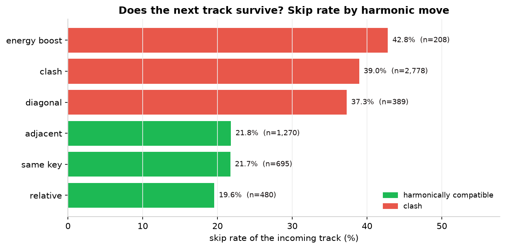
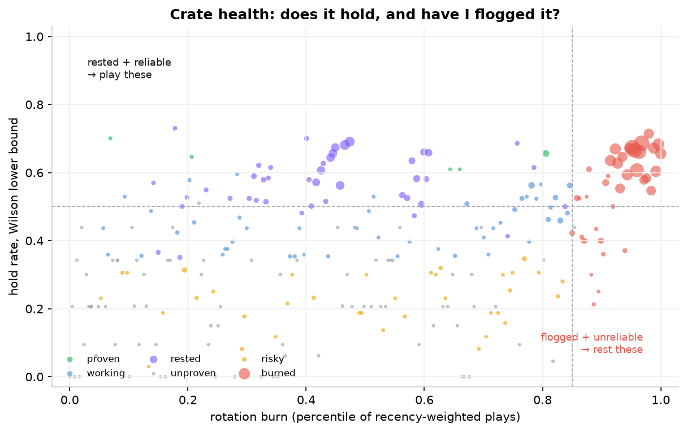
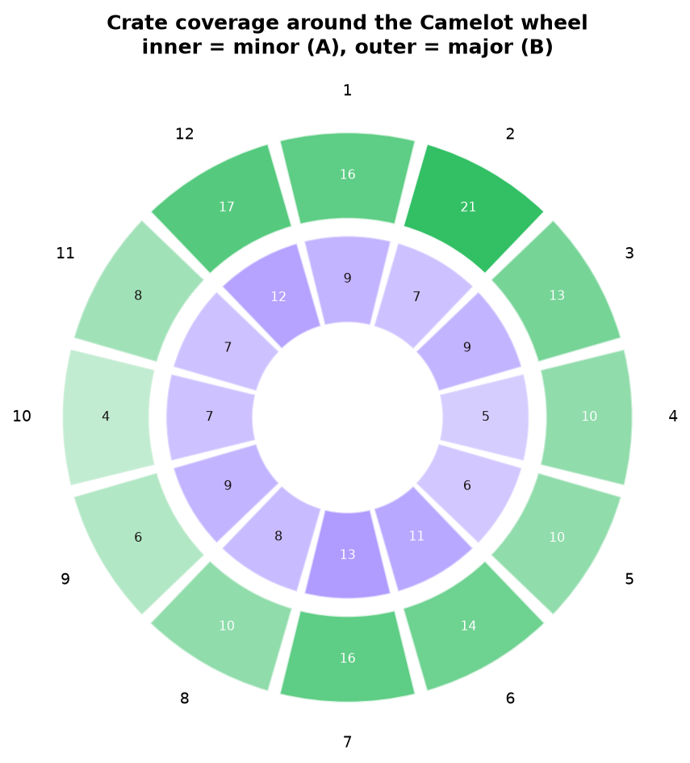
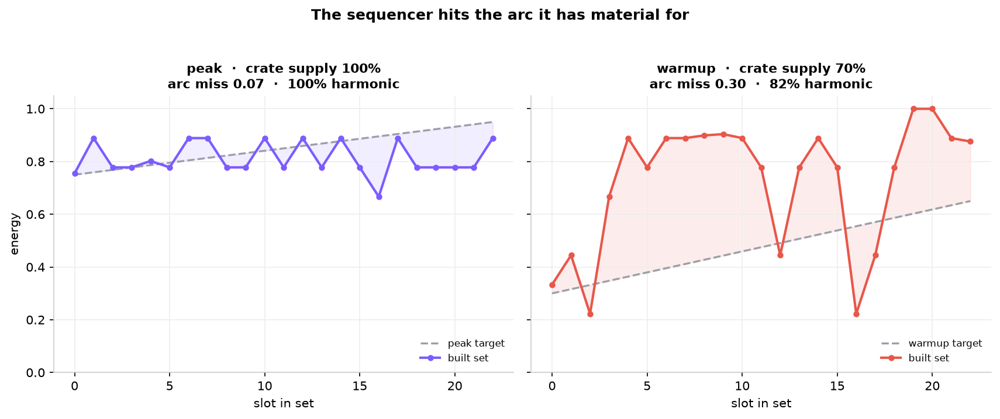

# Crate Intelligence

*I DJ. Wrapped tells me what I listened to, which is the least useful thing
about it. What I need before a gig is narrower: **which tracks hold a room**,
**which ones I've flogged to death**, and **what order any of it plays in**.*

So I pointed a product-analytics pipeline at three years of my own Spotify
history and made it answer those three questions.

**[→ Live dashboard](https://crate-intelligence.vercel.app)** · the set builder
runs in your browser.
**[→ REPORT.md](REPORT.md)** for the auto-generated findings ·
**[→ SPEC.md](SPEC.md)** for the build spec.

> Every number here comes from a **fully synthetic sample**
> ([`data/sample/`](data/sample)), so the repo runs end-to-end with zero personal
> data. Swapping in a real export is one flag — see [Running it](#running-it).
> The honest caveat about what that means is [at the bottom](#what-this-doesnt-prove),
> not buried.

---

## The three answers

| Question | Answer |
|---|---|
| Does harmonic mixing actually hold the listener? | **Yes — 1.70× the skip odds on a clashing transition** (95% CI 1.50–1.93), after adjusting for shuffle. Pooling would have said 2.35× — **38% overstated**. |
| What's burned out? | **37 of 248 tracks** are in the top burn decile. They're the *reliable* ones — that's why they got flogged. |
| Can I open a night with this? | **No.** The warmup arc is at 70% material supply: 72 tracks sit at the right energy but the wrong tempo. That's a gap in the record bag, not a bug in the sequencer. |



---

## Why this exists

The analytics half is ordinary product work — sessionization, cohort retention,
a hypothesis test. What makes it a *DJ* project is that every metric has a booth
translation, and the translation changes what you compute:

| Product metric | DJ question | What changes |
|---|---|---|
| Skip rate | Will this clear the floor? | Raw rates are useless at small n, so every rate is a **Wilson lower bound** |
| Cohort retention | Does a new artist survive in rotation? | Zero-filled denominators over fully-observed windows |
| Play recency | Have I over-rotated this? | **Exponentially-weighted** play load, 60-day half-life, percent-ranked |
| Session analysis | Which mixes have I actually played? | A **transition graph**, and whether the incoming track survived |

And then the part that isn't product analytics at all: given the crate, **build
a set**. That's a constrained sequencing problem, and it's where the work is.

---

## 1 · Does harmonic mixing hold the listener?

A skip on the *incoming* track is the closest thing streaming data has to
*the transition didn't work*. 5,820 in-session transitions, labelled by their
[Camelot](https://mixedinkey.com/harmonic-mixing-guide/) move:

| move | n | skip rate |
|---|---:|---:|
| relative (8A→8B) | 480 | 19.6% |
| same key | 695 | 21.7% |
| adjacent (8A→9A) | 1,270 | 21.8% |
| diagonal | 389 | 37.3% |
| **clash** | 2,778 | **39.0%** |
| +7 energy boost | 208 | 42.8% |

**The confound is the interesting part.** Shuffle raises the skip rate *and*
produces more clashing transitions — it's a common cause of both variables. Pool
them and you hand shuffle's skips to bad harmony:

```
                       clash      compatible     odds ratio
intentional plays      22.8%        14.5%           1.75
shuffle plays          51.2%        38.7%           1.66
                                          ──────────────────
Cochran–Mantel–Haenszel (adjusted)                  1.70  [1.50, 1.93]
if you pooled instead                               2.35  ← 38% overstated
```

So the test is [Cochran–Mantel–Haenszel](src/stats.py), stratified on shuffle,
with a Mantel–Haenszel common odds ratio and a Robins–Breslow–Greenland
interval. χ² = 67.9, p = 1.7e-16. The same test on tempo says jumping past the
±6% pitch fader costs you 1.60× [1.41, 1.80].

The implementation was checked against `statsmodels.StratifiedTable` to six
decimal places, and those values are [pinned in the tests](tests/test_stats.py)
so the check survives without the dependency. A Simpson's-paradox case is a
regression test, because that's the exact failure mode being defended against.

---

## 2 · The crate

Three questions per track: **does it hold**, **is it burned**, **do I have
enough evidence to say**.



Read that chart carefully, because the obvious expectation is wrong. The burned
tracks sit at the **top** right, not the bottom — they're flogged *because* they
hold. Reliability is what earns a track its overplay. "Rest these" is a
freshness call, not a quality one.

- **Holding** is a Wilson lower bound on the non-skip rate. A track played twice
  and never skipped shows a perfect 100%; ranking a crate on that puts the
  least-evidenced tracks on top. The bound does the shrinking.
- **Burn** is an exponentially-weighted recent play count (60-day half-life),
  percent-ranked across the crate — staleness only means anything relative to
  everything else you own.



Polar on purpose: the wheel's whole point is that neighbours mix, so a gap in
coverage is a spatial fact that a bar chart hides.

---

## 3 · Building a set

```
$ python -m src.setlist --arc peak --minutes 60 --explain

23 tracks · 66 min · mean transition 0.869 · 100% harmonic
 1. Paper Moons — Phantom Atlas  8B  134 BPM
 2. Nightshift — Quiet Parade  8B  136 BPM     [same_key +1.8% → 0.89]
 3. Featherweight — Drifting Ember  8B  137 BPM [same_key +0.1% → 0.86]
 4. Slow Burn — Iron Cinder  9B  136 BPM       [adjacent +0.7% → 0.86]
 ...
16. Gravity — Midnight Circuit  10A  136 BPM   [adjacent +2.3% → 0.80]
17. Aftertaste — Quiet Parade  11A  134 BPM    [adjacent +1.0% → 0.86]
18. Daydream — Neon Monsoon  12A  137 BPM      [adjacent +1.8% → 0.88]
```

It walks the wheel — 8B → 9B → 7B → 7A → 8A → 9A → 10A → 11A → 12A — holding
tempo drift under 2.5% per mix.

**The objective.** Each A→B step scores on five weighted components: the
harmonic move, tempo reachability (±6% fader, half- and double-time allowed, so
87 BPM mixes into 174), fit to the arc's energy target, energy *continuity*, and
the track's own crate readiness. Plus a small bonus for pairs already observed
holding in my history.

Hard constraints — no repeats, no artist inside a 3-track gap, no tempo jump
past the fader — **reject** candidates rather than scoring them down. Otherwise
a high enough harmonic score buys its way past a rule.

**Beam search, not greedy**, because greedy fails predictably: it takes the best
transition available now and strands itself in a corner of the wheel with
nothing that mixes out.

### Measured against baselines

"The optimiser works" needs a number, so every arc is benchmarked against greedy
and 200 constraint-respecting random orderings:

| arc | crate supply | harmonic | arc miss | beam | greedy | random | best of 200 |
|---|---:|---:|---:|---:|---:|---:|---:|
| warmup | 70% | 82% | 0.30 | **0.780** | 0.754 | 0.548 | 0.621 |
| peak | 100% | 100% | 0.07 | **0.869** | 0.849 | 0.568 | 0.634 |
| journey | 96% | 73% | 0.23 | **0.796** | 0.776 | 0.559 | 0.632 |
| closing | 96% | 100% | 0.09 | **0.858** | 0.858 | 0.563 | 0.639 |

100% of the beam's transitions are harmonically clean against **17%** for
random. But the lift over greedy is small — **most of the gain is the objective
and the hard constraints, not the lookahead.** Worth saying plainly rather than
dressing up.

### The finding I didn't plan for



The warmup set misses its arc badly, and the first version of the feasibility
check said the crate was fine — because the quiet tracks *do* exist. They're
downtempo, and you can't reach 92 BPM from a 137 BPM floor through a ±8% fader.
**Energy and tempo travel together in any real crate**, so material is only
available if it's also *tempo-reachable*.

Once feasibility accounts for that it both discriminates (warmup 70% vs peak
100%) and predicts the built set's arc miss (0.30 vs 0.07) — there's a
[test asserting that relationship](tests/test_setbuilder.py). So "this crate
can't open a night" is a finding the tool reports, not a defect it hides.

---

## Where BPM and key come from

The obvious design is to call Spotify's `/v1/audio-features` for every track
URI. **That door closed** — it was restricted to existing applications in
November 2024, so a project started after that can't get tempo or key from the
API at all.

Rather than pretend otherwise, features come from a **provider chain**
([`src/enrich.py`](src/enrich.py)), first hit wins:

1. **`CsvFeatureProvider`** — a Mixed In Key / Rekordbox / Traktor export. This
   is the real path: a working DJ has already analysed their library, so the
   authoritative BPM and key are sitting on their own disk. Column names are
   matched against per-tool aliases rather than a fixed schema.
2. **`SyntheticFeatureProvider`** — deterministic stand-ins from BLAKE2b over
   the track name. Tagged as its own source and counted separately so it can
   never be mistaken for a measurement. It exists so the repo runs for someone
   with no analysed library at all.

Adding a third provider is one method. Nothing downstream changes.

**The join is the hard part.** There's no shared identifier between a feature
export and a streaming history, so matching is fuzzy: accents, punctuation and
version suffixes (`Remastered 2011`, `Radio Edit`, `Original Mix`) all fold
together, while `Live` and `Acoustic` stay distinct — those really are different
recordings with different tempos. Apostrophes are deleted rather than spaced, so
`Don't` matches `Dont`. Coverage is always reported: an unmatched track is a
visible number, not a silent NULL. The sample runs at **93%**.

---

## How it's built

```
raw_streams                    src/load.py            JSON → typed table
  └─ plays (view)              sql/01_clean.sql       music only, local time, is_play/is_skip
       └─ sessions, binges     sql/02_sessions.sql    30-min-gap sessionization
            ↓
       track_features          src/enrich.py          provider chain + fuzzy join
       camelot_moves           src/enrich.py          24×24 lookup, generated from Python
            ↓
       ├─ volume / skip / HHI  sql/03_metrics.sql
       ├─ cohort retention     sql/04_cohorts.sql
       ├─ shuffle test inputs  sql/05_hypothesis.sql
       ├─ the crate            sql/06_crate.sql       hold, burn, set-readiness
       └─ transition graph     sql/07_transitions.sql edges + stratified test inputs
            ↓
       set construction        src/setbuilder.py      beam search + baselines
       static dashboard        src/export_web.py      → web/
```

DuckDB is the analytical core; Python is glue, statistics and search.

**One Camelot wheel, not two.** The SQL needs to know whether a transition is
harmonically clean, which means either reimplementing modular arithmetic in SQL
or generating the lookup from the Python that's already tested. It generates the
lookup — 576 rows is nothing, and it makes drift between the two implementations
*structurally impossible* rather than something a test has to catch afterwards.

The Wilson bound genuinely does live in both languages, because ranking a crate
has to be set-wise. So there's a
[parity test](tests/test_sql_models.py) across a grid of counts.

### Validation

Printed on every run: row reconciliation (every raw row accounted for), partial
edge-month exclusion, a timezone sanity check, feature coverage by source, and a
15/30/45-minute session-gap sensitivity sweep.

**290 tests.** CI runs lint and tests on Python 3.10 and 3.12, then diffs
`data/sample` against what the generator produces and `web/data` against what
the exporter produces — both are committed, so if either drifts the README
describes a file nobody can rebuild.

---

## Hosting

The dashboard is **static**. Nothing here needs a server: the analysis is a
batch job over a fixed export, so it runs once at build time and ships as files.
Free host, no cold starts, no secrets, nothing to fall over at 2am.

The one genuinely interactive part is the set builder — a page of pre-rendered
setlists is a screenshot, not a tool. So **the browser runs the beam search
itself**, over a graph scored by the same Python that scores it for the report.

The split keeps the domain model from existing twice: every component of a
transition's score except the energy-arc term is position-independent, so it's
precomputed per edge. The client adds one term and walks the graph. Arc curves
ship as 101 sampled points rather than formulas transcribed into JS — a sample
can't drift from its source, a transcription can. `tests/test_web_export.py`
holds that contract.

Total payload: **132 KB** for 7,718 plays. Vercel is the primary host; a GitHub
Pages workflow sits alongside it so the site isn't tied to one vendor.

---

## Running it

```bash
python -m venv .venv && source .venv/bin/activate   # Windows: .venv\Scripts\activate
pip install -r requirements.txt -r requirements-dev.txt

python src/generate_sample.py     # write the synthetic sample (already committed)
python -m src.run_analysis        # build → validate → figures → REPORT.md
python -m src.setlist --arc peak --minutes 90 --explain
make serve                        # dashboard at http://localhost:8000
```

Swapping in real data:

```bash
# Extended Streaming History from spotify.com/account/privacy (the Web API
# only returns the last 50 tracks), plus your own Mixed In Key / Rekordbox CSV.
python -m src.run_analysis --data data/raw --features ~/rekordbox-export.csv
```

Useful flags: `--session-gap 45`, `--burn-half-life 30`, `--set-minutes 120`,
`--no-figures`. `make check` runs what CI runs.

**Privacy:** real history is personal data and is never committed —
`data/raw/` is gitignored.

---

## What this doesn't prove

- **The sample is synthetic, and its generator queues harmonically-adjacent
  tracks on purpose.** The harmonic test is therefore *guaranteed* to find an
  effect here. What it demonstrates is the measurement machinery — the
  stratification, the odds ratios, the confounding estimate. The real experiment
  is running it against a real export. Saying otherwise would be dressing up a
  tautology as a result.
- **A skip is a proxy for a floor clearing, and not a great one.** This is
  listening history, not a club. It measures what I reach past on my own
  headphones, which correlates with what fails in a room but isn't the same thing.
- **Plays are autocorrelated within sessions.** Stratifying on shuffle handles
  the obvious confound, not the dependence structure. Descriptive evidence, not
  a randomised experiment.
- **The objective's weights are judgement calls.** They encode conventional
  booth practice, not anything measured. They're in one place and easy to argue
  with, which is the most that can honestly be claimed for them.
- **Left-censoring:** everything heard in the first month looks newly
  discovered, so that month is excluded from the discovery trend.
- **Fixed-offset timezone:** exact for IST (no DST); a DST timezone needs
  DuckDB's ICU extension.

## License

[MIT](LICENSE).
