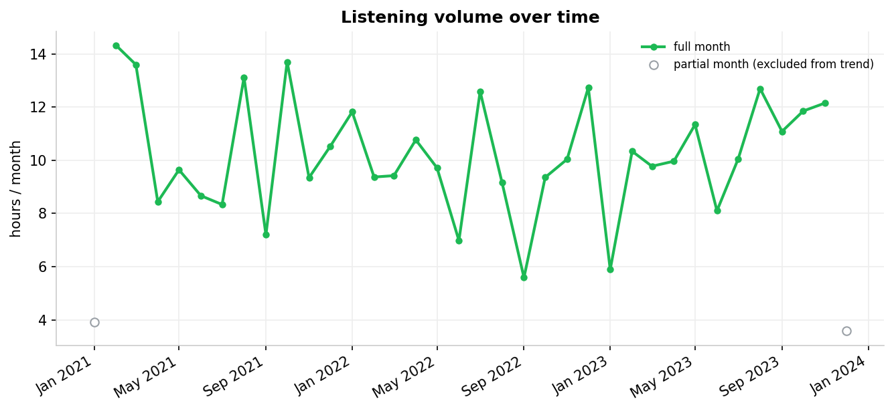
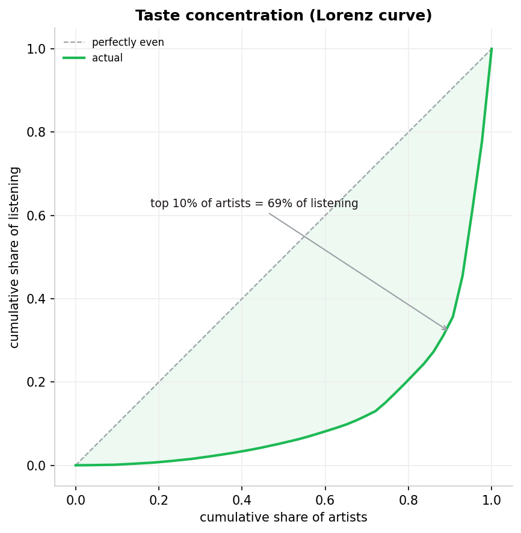
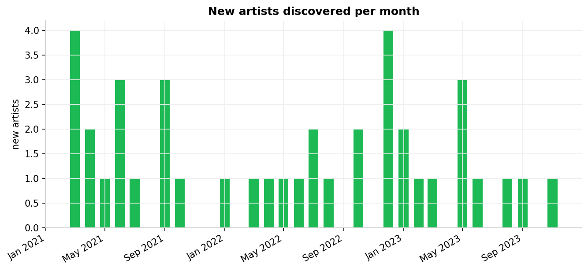

# Spotify Listening Analysis — Findings

> Auto-generated by `python -m src.run_analysis`. Numbers below are computed from the loaded dataset; re-run to refresh.

## Dataset

- **7,978** music plays (**6,218** counted, ≥30s) across **1,248** sessions and **45** artists
- Range **2021-01-20 → 2023-12-09**, **347 hours** of counted listening

## Findings

1. **Listening volume.** Busiest year was **2021** (~121 h). Listening peaks **Sunday around 21:00** local.
   
   

2. **Skip rate — the honest number Wrapped never shows: 22.1%.** On shuffle it is **34.9%** vs **11.6%** on intentional plays; discovery plays skip at 24.3% vs 22.0% for familiar tracks.
   

3. **Taste concentration.** The top 10% of artists account for **68.9%** of listening (top 1%: 22.3%); HHI = **0.119**.
   

4. **Discovery.** ~**1.7 new artists/month** (taste looks expanding).
   

5. **Artist retention.** Of artists discovered in a month, **83.3%** are still played 1 month later, **65.9%** at 3 months, **48.7%** at 6 months.
   

6. **Most binged.** *Ceilings* by Phantom Lantern — **4** consecutive plays in one session.

## Hypothesis test

**H1: skip rate is higher on shuffle than on intentional plays.**

- shuffle 34.9% (1,248/3,578) vs intentional 11.6% (512/4,400)
- difference **23.2%**, two-proportion z = **24.9**, one-sided p = **3.65e-137** (statistically significant)
- effect size Cohen's h = **0.57**
- *Caveat:* plays are autocorrelated within sessions, so treat this as descriptive evidence, not a clean randomized experiment (SPEC §7.3).

## Validation (SPEC §12)

- **Row reconciliation:** 8,140 raw = 7,978 music plays + 162 podcasts + 0 null-name dropped -> balanced ✓
- **Edge months excluded from trends:** 2021-01, 2023-12
- **Timezone sanity:** peak listening at Sunday 21:00 local -> plausible ✓
- **Session-gap sensitivity:** 15min -> 1,271 sessions; 30min -> 1,248 sessions; 45min -> 1,224 sessions
