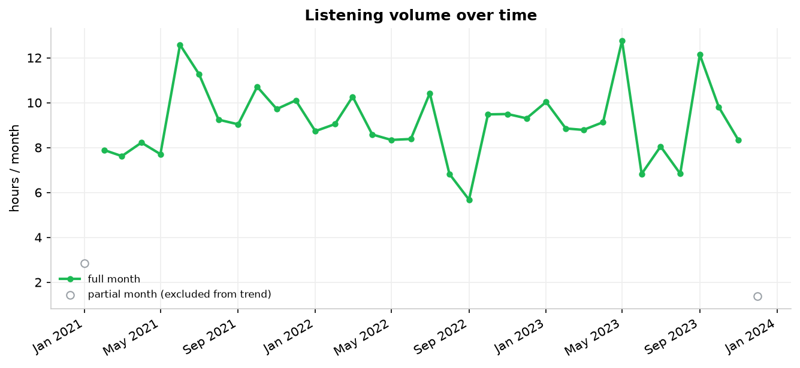
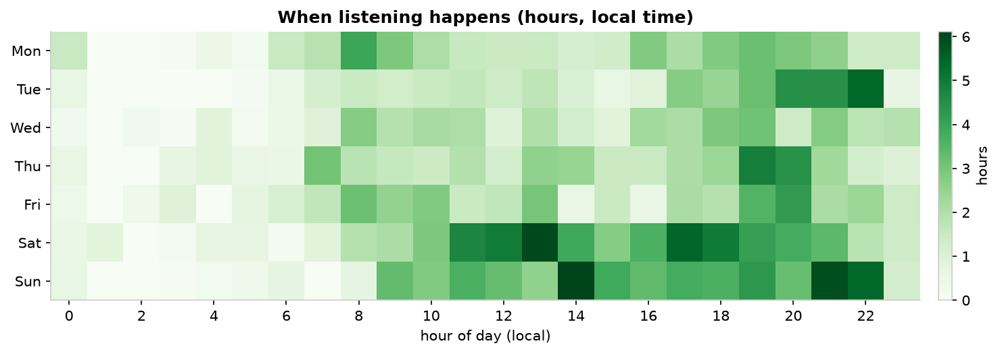
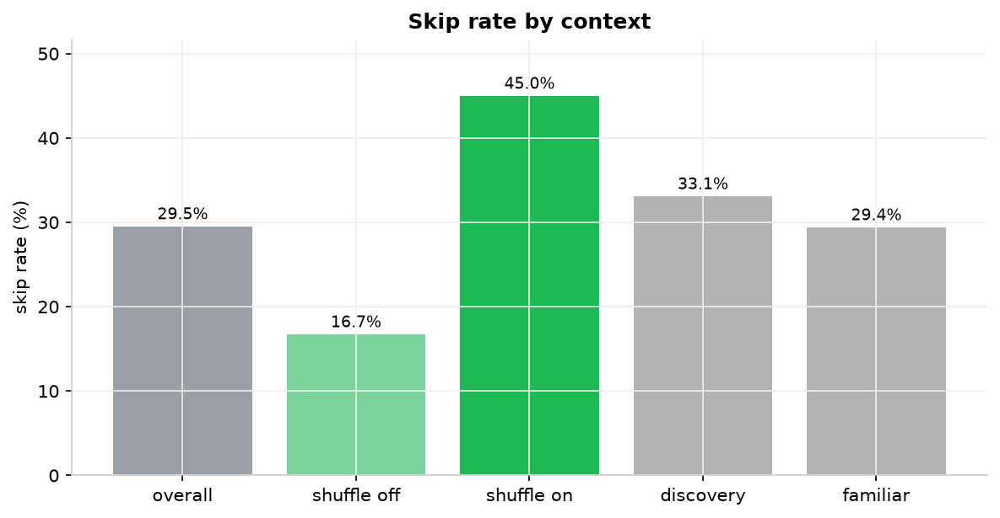
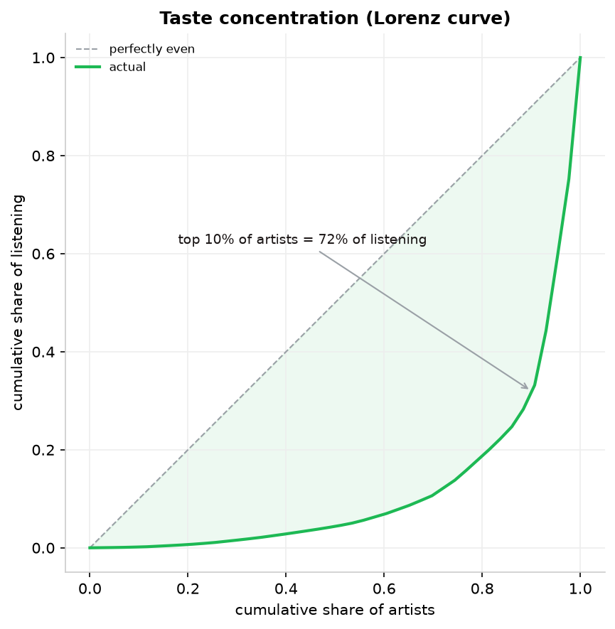
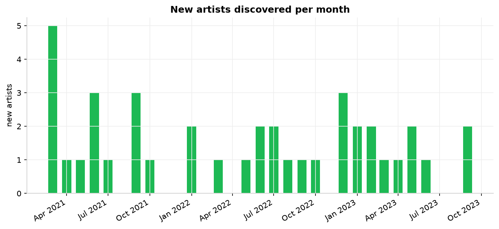
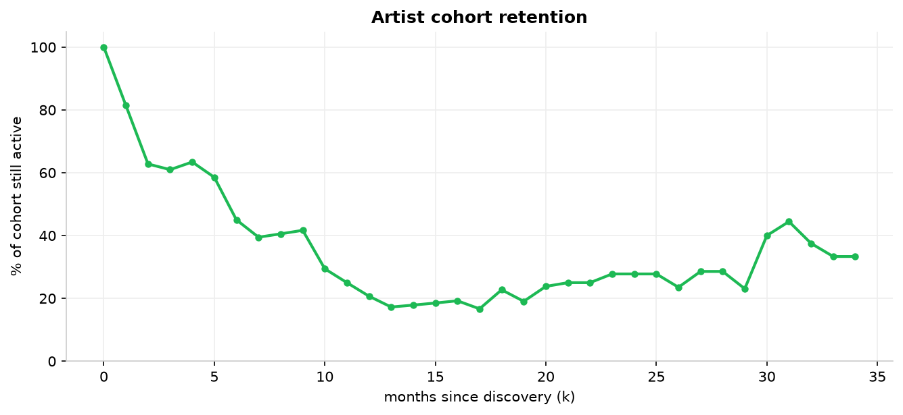

# Spotify Listening Analysis — Findings

> Auto-generated by `python -m src.run_analysis`. Numbers below are computed from the loaded dataset; re-run to refresh.

## Dataset

- **7,718** music plays (**5,441** counted, ≥30s) across **1,236** sessions and **44** artists
- Range **2021-01-21 → 2023-12-10**, **304 hours** of counted listening

## Findings

1. **Listening volume.** Busiest year was **2021** (~107 h). Listening peaks **Sunday around 14:00** local.
   
   

2. **Skip rate — the honest number Wrapped never shows: 29.5%.** On shuffle it is **45.0%** vs **16.7%** on intentional plays; discovery plays skip at 33.1% vs 29.4% for familiar tracks.
   

3. **Taste concentration.** The top 10% of artists account for **71.8%** of listening (top 1%: 24.8%); HHI = **0.129**.
   

4. **Discovery.** ~**1.7 new artists/month** (taste looks expanding).
   

5. **Artist retention.** Of artists discovered in a month, **81.4%** are still played 1 month later, **61.0%** at 3 months, **45.0%** at 6 months.
   

6. **Most binged.** *Telegraph* by Phantom Lantern — **5** consecutive plays in one session.

## Hypothesis test

**H1: skip rate is higher on shuffle than on intentional plays.**

- shuffle 45.0% (1,572/3,496) vs intentional 16.7% (705/4,222)
- difference **28.3%**, two-proportion z = **27.1**, one-sided p = **4.20e-162** (statistically significant)
- effect size Cohen's h = **0.63**
- *Caveat:* plays are autocorrelated within sessions, so treat this as descriptive evidence, not a clean randomized experiment (SPEC §7.3).

## Validation (SPEC §12)

- **Row reconciliation:** 7,864 raw = 7,718 music plays + 146 podcasts + 0 null-name dropped -> balanced ✓
- **Edge months excluded from trends:** 2021-01, 2023-12
- **Timezone sanity:** peak listening at Sunday 14:00 local -> plausible ✓
- **Session-gap sensitivity:** 15min -> 1,261 sessions; 30min -> 1,236 sessions; 45min -> 1,217 sessions
