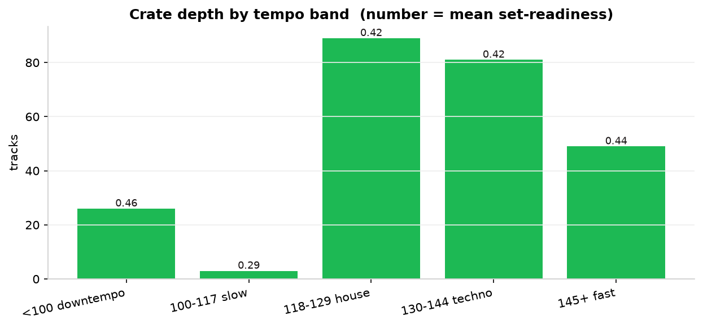

# Crate Intelligence — Findings

> Auto-generated by `python -m src.run_analysis`. Numbers below are computed from the loaded dataset; re-run to refresh.

## Dataset

- **7,718** music plays (**5,441** counted, ≥30s) across **1,236** sessions and **44** artists
- Range **2021-01-21 → 2023-12-10**, **304 hours** of counted listening

## Findings

1. **Listening volume.** Busiest year was **2021** (~107 h). Listening peaks **Sunday around 14:00** local.
   
   

2. **Skip rate — the honest number Wrapped never shows: 29.5%.** On shuffle it is **45.0%** vs **16.7%** on intentional plays; discovery plays skip at 33.1% vs 29.4% for familiar tracks.
   

3. **Taste concentration.** The top 10% of artists account for **71.8%** of listening (top 1%: 24.8%); HHI = **0.129**.
   

4. **Discovery.** ~**1.7 new artists/month** (taste looks expanding).
   

5. **Artist retention.** Of artists discovered in a month, **81.4%** are still played 1 month later, **61.0%** at 3 months, **45.0%** at 6 months.
   

6. **Most binged.** *Telegraph* by Phantom Lantern — **5** consecutive plays in one session.

## Hypothesis test — shuffle

**H1: skip rate is higher on shuffle than on intentional plays.**

- shuffle 45.0% (1,572/3,496) vs intentional 16.7% (705/4,222)
- difference **28.3%**, two-proportion z = **27.1**, one-sided p = **4.20e-162** (statistically significant)
- effect size Cohen's h = **0.63**
- *Caveat:* plays are autocorrelated within sessions, so treat this as descriptive evidence, not a clean randomized experiment (SPEC §7.3).

## The crate

248 distinct tracks, 248 carrying a key across 24/24 Camelot slots. By status: **80** unproven, **47** working, **43** rested, **37** burned, **36** risky, **5** proven.
Deepest tempo band is **118-129 house** (89 tracks).
   
   
   

**Rest these** (top of the burn ranking): *Gravity* — Iron Cathedral (185 plays, 1d rested); *Ceilings* — Iron Cathedral (195 plays, 0d rested); *Afterglow* — Iron Cathedral (187 plays, 1d rested).
**Bring these back** (reliable, long dormant): *Aftertaste* — Saffron Garden (17 plays, 846d rested); *Afterglow* — Neon Signal (25 plays, 554d rested); *Featherweight* — Neon Monsoon (138 plays, 542d rested).

## Do harmonic transitions actually hold?

5,820 in-session transitions over 2,941 distinct ordered pairs. Skip rate of the *incoming* track, by harmonic move:

| move | n | skip rate |
|---|---:|---:|
| relative | 480 | 19.6% |
| same key | 695 | 21.7% |
| adjacent | 1,270 | 21.8% |
| diagonal | 389 | 37.3% |
| clash | 2,778 | 39.0% |
| energy boost | 208 | 42.8% |

   

**H2: a clashing transition loses the incoming track more often.**

Tested with Cochran-Mantel-Haenszel, stratified on shuffle. Shuffle raises the skip rate *and* produces more clashes, so it is a common cause of both variables and pooling would credit its skips to bad harmony:

- *intentional*: clash 22.8% (330/1,448) vs compatible 14.5% (253/1,750), OR **1.75**
- *shuffle*: clash 51.2% (986/1,927) vs compatible 38.7% (269/695), OR **1.66**
- adjusted (MH) odds ratio **1.70** [1.50, 1.93], CMH chi-square **67.9**, p = **1.69e-16**
- **the confound was worth measuring:** pooling gives an odds ratio of 2.35, so ignoring shuffle would have overstated the harmonic effect by **38%**
- the same test on tempo: jumping past the ±6% pitch fader carries an adjusted odds ratio of **1.60** [1.41, 1.80], p = 4.41e-14

> *Caveat, and the honest one:* the committed sample is synthetic and its generator queues harmonically-adjacent tracks on purpose, so this test is **guaranteed** to find an effect here. What it demonstrates is the measurement machinery — the stratification, the odds ratios, the confounding estimate. The actual experiment is running it against a real export.

## Building a set

Beam search over the crate, scoring every transition on harmonic move, tempo reachability, fit to the arc's energy target, energy continuity, and the track's own crate readiness — with hard constraints for repeats, artist spacing and the pitch fader.

| arc | crate supply | harmonic | arc miss | beam | greedy | random |
|---|---:|---:|---:|---:|---:|---:|
| warmup | 70% | 82% | 0.30 | **0.780** | 0.754 | 0.548 |
| peak | 100% | 100% | 0.07 | **0.869** | 0.849 | 0.568 |
| journey | 96% | 73% | 0.23 | **0.796** | 0.776 | 0.559 |
| closing | 96% | 100% | 0.09 | **0.858** | 0.858 | 0.563 |

   

**Finding: this crate cannot open a night.** The *warmup* arc is not supported by this crate — mean supply 70%, thinnest at slot 1/23 where it wants energy 0.30. The quiet tracks exist, but 72 of them sit outside pitch-fader reach of where the set is running, because energy and tempo travel together. That is a gap in the record bag, not a bug in the sequencer.

Against the baselines on the *peak* arc: beam **0.869** vs greedy 0.849 vs random 0.568 (best of 200: 0.634); **100%** of the beam's transitions are harmonically clean against 17% for random. The lift over greedy is real but small — most of the gain is in the objective and the hard constraints, not the lookahead.

### Example: the peak-time set

```
23 tracks · 63 min · mean transition 0.869 · 100% harmonic
 1. Paper Moons — Phantom Atlas  8B  134 BPM
 2. Nightshift — Quiet Parade  8B  136 BPM   [same_key +1.8% → 0.90]
 3. Slow Burn — Iron Cinder  9B  136 BPM   [adjacent +0.5% → 0.87]
 4. Runaway — Phantom Circuit  9B  137 BPM   [same_key +1.2% → 0.89]
 5. Saltwater — Neon Signal  8B  140 BPM   [adjacent +1.7% → 0.88]
 6. Paper Moons — Echo Meadow  7B  140 BPM   [adjacent +0.1% → 0.86]
 7. Runaway — Quiet Parade  7B  138 BPM   [same_key +0.9% → 0.95]
 8. Overgrown — Midnight Circuit  7B  140 BPM   [same_key +1.2% → 0.86]
 9. Telegraph — Iron Cinder  7A  142 BPM   [relative +1.3% → 0.86]
10. Backseat — Echo Meadow  8A  139 BPM   [adjacent +1.8% → 0.85]
11. Half Light — Quiet Parade  8A  137 BPM   [same_key +1.9% → 0.93]
12. Stillwater — Amber Current  9A  135 BPM   [adjacent +1.2% → 0.85]
13. Lowlands — Iron Cinder  9A  133 BPM   [same_key +1.8% → 0.90]
14. Wildfire — Drifting Ember  9A  136 BPM   [same_key +2.8% → 0.84]
15. Mercury — Quiet Parade  9A  139 BPM   [same_key +2.1% → 0.93]
16. Cold Glass — Quiet Static  8A  137 BPM   [adjacent +1.5% → 0.83]
17. Coastline — Iron Cinder  7A  140 BPM   [adjacent +2.0% → 0.85]
18. Mercury — Drifting Avenue  6A  137 BPM   [adjacent +2.1% → 0.84]
19. Featherweight — Echo Meadow  6A  133 BPM   [same_key +2.6% → 0.83]
20. Rooftops — Wild Anchor  7A  130 BPM   [adjacent +2.6% → 0.80]
21. Undertow — Hollow Mirage  7A  128 BPM   [same_key +1.8% → 0.88]
22. Wildfire — Iron Static  8A  128 BPM   [adjacent +0.5% → 0.85]
23. Mercury — Amber Current  9A  129 BPM   [adjacent +0.4% → 0.88]
```

## Validation (SPEC §12)

- **Row reconciliation:** 7,864 raw = 7,718 music plays + 146 podcasts + 0 null-name dropped -> balanced ✓
- **Edge months excluded from trends:** 2021-01, 2023-12
- **Timezone sanity:** peak listening at Sunday 14:00 local -> plausible ✓
- **Feature coverage:** 248 tracks | 93% from analysed library (crate_features 231, synthetic 17) -> usable ✓
- **Crate tagged for mixing:** 248/248 tracks carry a key, spread over 24/24 Camelot slots
- **Session-gap sensitivity:** 15min -> 1,261 sessions; 30min -> 1,236 sessions; 45min -> 1,217 sessions
